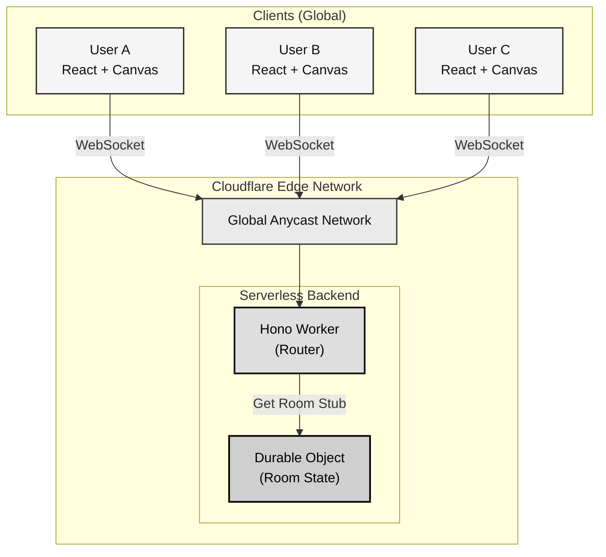

# ⚡ Edge-Native Real-Time Whiteboard

A globally distributed, collaborative whiteboard application built on **Cloudflare Workers**, **Durable Objects**, and **WebSockets**.

This project demonstrates how to build serverless, stateful real-time systems that run at the edge, eliminating cold starts and reducing latency for users worldwide.


**Diagram**




**Make sure to have two or more live users who are using the same link**
🔗 **[Live Demo](https://parikshith-s.github.io/Edge-Native-Whiteboard/)**

---

## 🚀 Key Features

* **Global Real-Time Sync**: Sub-50ms latency synchronization using WebSockets.
* **Edge-Native Architecture**: Runs entirely on Cloudflare's edge network (no traditional servers).
* **Stateful Serverless**: Uses **Durable Objects** to maintain room state and guarantee consistency.
* **Zero Cold Starts**: Instant connection handling compared to AWS Lambda/traditional serverless.
* **Multiplayer**: Supports multiple concurrent users drawing in the same room.

---

## 🏗️ Architecture

This system moves beyond traditional client-server architecture by running logic physically closer to the user.

### 1. The Compute (Cloudflare Workers + Hono)
Instead of a central server in `us-east-1`, the backend is replicated across Cloudflare's 300+ global locations. The application logic uses **Hono**, a lightweight web framework optimized for the edge.

### 2. The State (Durable Objects)
Serverless functions are usually stateless. To handle a real-time chat/whiteboard, we need state (who is in the room? what was drawn?).
* We use **Cloudflare Durable Objects** to create a unique, single-point-of-truth for every whiteboard room.
* All users joining "Room A" are globally routed to the specific Durable Object instance handling "Room A", ensuring strong consistency.

### 3. The Protocol (WebSockets)
* The frontend connects via **WebSocket (WSS)** directly to the Durable Object.
* When User A draws, the stroke data is sent to the Edge.
* The Edge immediately broadcasts that stroke to User B, User C, etc.

---

## 🛠️ Tech Stack

* **Frontend**: React 18, TypeScript, Vite, TailwindCSS, HTML5 Canvas
* **Backend**: Cloudflare Workers, Hono, Durable Objects
* **Language**: TypeScript (End-to-End)
* **Deployment**: Cloudflare Workers (Backend), GitHub Pages (Frontend)

---

## 💻 Local Development Guide

Follow these steps to run the distributed system locally on your machine.

### Prerequisites
* **Node.js** (v18 or later)
* **Cloudflare Account** (Free tier works perfectly)
* **Wrangler CLI** (`npm install -g wrangler`)

### 1. Clone the Repo
```bash
git clone [https://github.com/YOUR_USERNAME/Edge-Native-Whiteboard.git](https://github.com/YOUR_USERNAME/Edge-Native-Whiteboard.git)
cd Edge-Native-Whiteboard
```

### 2. Setup Backend (The Edge)
The backend runs on port `8787`.
```bash
cd backend
npm install

# Login to Cloudflare (Required for Durable Objects locally)
npx wrangler login

# Start local server
npm run dev
```

### 3. Setup Frontend (The Client)
Open a new terminal. The frontend runs on port `5173`.
```bash
# Moving to frontend folder 
cd frontend
npm install

# Start local dev server
npm run dev
```

### 4. Verify
Open `http://localhost:5173` in <u>two different browser windows</u>. Drawing in one should instantly appear in the other.

---

## 🌍 Deployment

### Backend (Cloudflare)
```bash
cd backend
npm run deploy
```
Copy the `*.workers.dev` URL provided in the output.

### Frontend (GitHub Pages)

### 1. Create a `.env` file in `frontend/`:
```bash
VITE_BACKEND_URL=wss://your-worker-subdomain.workers.dev
```

### 2. Deploy
```bash
cd frontend
npm run deploy
```

---

## 📝 License

Copyright (c) 2025 Parikshith Saraswathi
